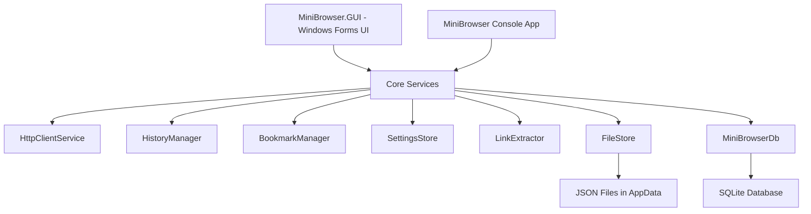

# MiniBrowser

MiniBrowser is a lightweight desktop web browser built with C# and .NET. The project includes both a console-based browser and a Windows Forms GUI version. It was developed to demonstrate HTTP request handling, URL navigation, bookmark management, browsing history, user profiles, local data persistence, and optional SQLite storage using Entity Framework Core.

The project is useful as a small but complete C# application because it separates the core browser logic from the user interface. The same core services are reused by both the console application and the Windows Forms GUI.

## Project Highlights

- Built using C# and .NET 9
- Windows Forms GUI with address bar, navigation buttons, status display, and side tabs
- Console version for testing browser logic without the GUI
- HTTP page loading using `HttpClient`
- HTML preview mode and optional rendered browsing using WebView2
- Back, forward, reload, home, and set home page features
- Link extraction from loaded HTML pages
- Bookmark add, edit, delete, and open features
- Browsing history with recent page list
- Multi-user profile support
- JSON-based local storage by default
- Optional SQLite database storage using Entity Framework Core
- Clean separation between core logic and UI layer

## Tech Stack

| Area | Technology |
|---|---|
| Language | C# |
| Framework | .NET 9 |
| GUI | Windows Forms |
| Web Rendering | Microsoft WebView2 |
| HTTP Handling | HttpClient |
| Data Storage | JSON files / SQLite |
| ORM | Entity Framework Core |
| IDE | Visual Studio |

## Project Structure

```text
MiniBrowser-main/
│
├── MiniBrowser.sln
├── .gitignore
│
├── MiniBrowser/
│   ├── MiniBrowser.csproj
│   ├── Program.cs
│   │
│   └── Core/
│       ├── BookmarkManager.cs
│       ├── FileStore.cs
│       ├── HistoryManager.cs
│       ├── HttpClientService.cs
│       ├── HttpResult.cs
│       ├── LinkExtractor.cs
│       ├── SettingsStore.cs
│       ├── UrlTools.cs
│       │
│       └── Data/
│           └── MiniBrowserDb.cs
│
└── MiniBrowser.GUI/
    ├── MiniBrowser.GUI.csproj
    ├── Program.cs
    ├── Form1.cs
    ├── Form1.Designer.cs
    └── Form1.resx
```

## Application Architecture

The project is organised into two main parts.

The `MiniBrowser` project contains the core browser logic. It handles URL cleaning, HTTP requests, bookmarks, history, settings, file storage, and database storage. This project also includes a console browser interface.

The `MiniBrowser.GUI` project contains the Windows Forms desktop interface. It references the core `MiniBrowser` project and uses the same managers and services to provide a graphical browser experience.



## Main Features

### 1. URL Navigation

Users can enter a URL in the address bar or console prompt. If the user enters a plain domain without `http://` or `https://`, the application automatically adds `https://` using the `UrlTools` class.

Example:

```text
google.com → https://google.com
```

### 2. HTTP Page Loading

The `HttpClientService` class sends HTTP GET requests and returns a structured `HttpResult` object containing:

- Status code
- Reason message
- Final URL
- HTML body

The service also handles common errors such as network failures, timeouts, and unexpected exceptions, so the application does not crash when a page cannot be loaded.

### 3. HTML Preview and Render Mode

The GUI displays the HTML source of the loaded page in a text area by default. It also includes a `Render` option that uses WebView2 to show the page in rendered browser view.

This gives two useful modes:

- HTML source preview for learning and inspection
- Rendered view for normal browsing

### 4. Back, Forward, Reload, and Home

The application supports basic browser navigation:

- Back
- Forward
- Reload
- Home
- Set current/custom page as home

The `HistoryManager` keeps track of the current page index, so back and forward navigation work like a simple browser history stack.

### 5. Link Extraction

The `LinkExtractor` class scans the HTML response and extracts the first five links found on the page. These links are displayed in the GUI side panel and can be opened by double-clicking.

This demonstrates simple HTML parsing using regular expressions and URL resolution using the base page URL.

### 6. Bookmark Management

Users can save useful pages as bookmarks. The bookmark system supports:

- Add bookmark
- Edit bookmark
- Delete bookmark
- Open bookmark
- Avoid duplicate bookmark URLs

Bookmarks are managed through the `BookmarkManager` class and can be stored either as JSON files or in SQLite.

### 7. Browsing History

Visited pages are automatically added to history. The GUI shows recent history in a separate tab, and the console version provides a command to show recently visited pages.

The history system avoids consecutive duplicate URLs and supports back/forward navigation.

### 8. Multi-User Profiles

The GUI includes a switch user option. Each user can have their own:

- Home page setting
- Bookmarks
- Browsing history

Usernames are normalised internally to keep file names and stored records consistent.

### 9. JSON and SQLite Storage Modes

The application supports two storage modes.

By default, it stores data as JSON files under the user's AppData folder:

```text
AppData/Roaming/MiniBrowser/
```

It can also switch to SQLite database mode. The SQLite database is created automatically using Entity Framework Core when database mode is selected.

Stored data includes:

- Bookmarks
- History
- User settings

## Core Classes

| Class | Purpose |
|---|---|
| `HttpClientService` | Sends HTTP requests and returns page response data |
| `HttpResult` | Stores response status, final URL, and HTML body |
| `UrlTools` | Cleans and normalises user-entered URLs |
| `LinkExtractor` | Extracts the first five links from HTML content |
| `HistoryManager` | Handles history, back, forward, and recent pages |
| `BookmarkManager` | Handles bookmark add, edit, delete, and persistence |
| `SettingsStore` | Stores home page, current user, and storage mode |
| `FileStore` | Reads and writes JSON files under AppData |
| `MiniBrowserDb` | Entity Framework Core SQLite database context |
| `Form1` | Main Windows Forms GUI logic |

## Console Commands

The console version supports the following commands:

| Command | Description |
|---|---|
| blank input | Open home page |
| `r` | Reload current page |
| `b` | Go back |
| `f` | Go forward |
| `h` | Show recent history |
| `bm` | List bookmarks |
| `addbm` | Add a bookmark |
| `openbm <n>` | Open bookmark by index |
| `delbm <n>` | Delete bookmark by index |
| `sethome <url>` | Set home page |
| `q` | Quit the application |

## GUI Overview

The Windows Forms interface includes:

- Address bar
- Go button
- Back and forward buttons
- Reload button
- Home button
- Set Home option
- Render toggle using WebView2
- Links tab
- Bookmarks tab
- History tab
- Menu options for user switching and storage mode switching

The GUI is designed as a simple desktop browser interface while keeping the main logic inside the reusable core classes.

## Data Storage

### JSON Storage

JSON is the default storage mode. Files are stored in the user's AppData folder.

Example files:

```text
settings_default.json
bookmarks_default.json
history_default.json
```

For different users, separate files are created.

### SQLite Storage

SQLite storage is handled through Entity Framework Core. The database file is created inside the MiniBrowser AppData folder.

Example database path:

```text
AppData/Roaming/MiniBrowser/minibrowser.db
```

Database tables include:

- Users
- Bookmarks
- History
- Settings

## How to Run the Project

### Requirements

- Windows OS
- Visual Studio 2022 or later
- .NET 9 SDK
- Microsoft Edge WebView2 Runtime

### Run Using Visual Studio

1. Clone the repository.
2. Open `MiniBrowser.sln` in Visual Studio.
3. Restore NuGet packages if required.
4. Set `MiniBrowser.GUI` as the startup project for the desktop GUI.
5. Run the project.

To run the console version, set `MiniBrowser` as the startup project.

### Run Using Command Line

To run the console app:

```bash
dotnet run --project MiniBrowser/MiniBrowser.csproj
```

To run the GUI app:

```bash
dotnet run --project MiniBrowser.GUI/MiniBrowser.GUI.csproj
```

## NuGet Packages Used

The project uses the following main packages:

```text
Microsoft.EntityFrameworkCore
Microsoft.EntityFrameworkCore.Sqlite
Microsoft.Web.WebView2
```

## What I Learned from This Project

This project helped me practise building a desktop application with a clear separation between business logic and user interface. It also helped me understand how browser-like features work internally, including HTTP requests, URL handling, history stacks, bookmarks, local storage, and simple database persistence.

It also gave practical experience in working with Windows Forms, WebView2, JSON file handling, and Entity Framework Core with SQLite.

## Recruiter Notes

This project demonstrates:

- C# and .NET desktop application development
- Object-oriented design
- Separation of concerns between UI and core services
- Local persistence using both JSON and SQLite
- Basic database modelling with Entity Framework Core
- Error handling for network-based applications
- Building a functional GUI using Windows Forms
- Practical understanding of browser-like navigation features

## Future Improvements

Possible future improvements include:

- Add tabbed browsing
- Add search engine integration
- Improve HTML parsing using a dedicated parser library
- Add download support
- Add favourite icons for bookmarks
- Add import/export bookmarks feature
- Add unit tests for core services
- Add better error messages in the GUI
- Add browser session restore
- Add support for private browsing mode

## Repository Clean-Up Note

Before pushing the project to GitHub, make sure generated build folders are not committed:

```text
bin/
obj/
.vs/
*.user
```

These are already included in the `.gitignore`, but if they were committed earlier, remove them from Git tracking before pushing the final version.

## Author

Created by Nimijith Nimmi Jayan.
